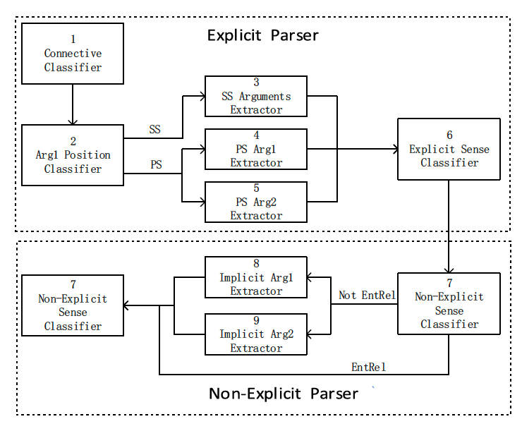
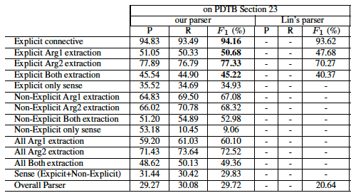

## System overview

# Components

## Connective Classifier
- Cstring       (case-sensitive)
- self-category: what part of the syntactic feature it functions in the sentence.
- parent-category: 
e.g. you and me, and parent category is an NP.
- left-sibling-category \
e.g. If the left sibling does not exist, this features takes the value “NONE”. If it is None, then it will be the first string in the parent category.
- right-sibling-category \
English is a right-branching language, and so dependents tend to occur after their heads. \
If the connective string has a discourse function, then this dependent will often be a clause (SBAR) \
e.g. “After I went to the store, I went home” can be distinguished from the nondiscourse usage in “After May, I will go on vacation” 
- C-Syn interaction         (the pairwise interaction features between the connective C and each category feature (i.e. self-category, parent-category, left-sibling-category, right-siblingcategory))
- Syn-Syn interaction           (the interaction features between pairs of category features)\
`Note: the last two method boost F1 score around 2%`
- two binary features that check whether the right sibling contains a VP and/or a trace.\
refer to the paper why

(2) Lin’s:
- C POS, 
- prev1 + C string,  (the first previous word)
- prev1 POS, 
- prev1 POS + C POS, 
- C string + next1, 
- next1 POS, 
- C POS + next1 POS, 
- path of C’s parent to root, 
- compressed path of C’s parent -> root; \
`Note : The first seven feature classes model the connective’s context and POS, while the last two are the path from C to the root and the compressed path where adjacent identical tags are combined` \
e.g. for "after" if it follows a verbing, then it most likely to be a connective.

(3) New: 
- the POS tags of nodes from C’s parent -> root
- parent-category linked context, 
- right-sibling-category linked context. 

"link context" mean the POS combination of node, parent, children. it covers more syntactic info.

## Arg1 position Classifier
(1) Lin’s: 
- C string, \
`itself is a good sign, And & and, result in PS and SS`
- C position (the position of connective C in the sentence: start, middle, or end),\
`when always indicate SS`
- C POS, 
- prev1,
- prev1 POS, 
- prev1 +C, 
- prev1 POS+C POS, 
- prev2,
- prev2 POS, 
- prev2 + C, 
- prev2 POS + C POS;
`Mainly contextual feature`

(2) New: 
1. C POS + next1 POS
2. next2, 
3. path of C->root.

## Argument extractor

### SS arg extractor
They adopt this method without Joint Inference

`Intuition: Our intuition is that the two arguments have different syntactic and discourse properties and a unified model with the same feature set used for both may not have enough discriminating power.`

### PS Arg1 Extractor
1. split sentence into clauses and sequence tag it.
2. added attribution features. TODO: what does it mean
3. adapting Following features:

(1) Lin: 
- lemmatized verbs in curr, 
- the first term of curr, 
- the last term of curr,
- the last term of prev + the first term of curr
(2) our proposed connective-related features: 
- lowercased C string
- C category TODO: how does it know what category is it.

`Note: it contains the minimum span of text to clarify for relation` TODO: what does it mean to coding the structure? \
`Note: the idea here is to capture "connective related information" to capture text span for relation`\
 TODO: maybe more features?  

### PS Arg2 Extractor
1. split the sentence( nine punct + conn itself)
2. Different features:

VERBS
- lowercased verbs in curr, lemmatized
- verbs in curr,

CONNECTION
- the first term of curr, 
- the last term of curr, 
- the last term of prev, 
- the first term of next, 
- the last term of prev + the first term of curr, 
- the last term of curr + the first term of next,

PRODUCTION RULES
- production rules extracted from curr, 

CUR POSITION
- curr position (start, middle or end),

CONN FEATURE
- C string, 
- lowercased C string, 
- C position, 
- C category,
- path of C’s parent->root, 
- compressed path of C’s parent -> root.

TODO: why there is no POS tag?

## Explicit Sense Classifier
(1) Lin’s features: 
1. C string, 
2. C POS,
3. prev1 + C 

(2) Pitler’s features: 
1. self-category,
2. parent-category, 
3. left-sibling-category, 
4. right-siblingcategory,
5. C-Syn interaction, 
6. Syn-Syn interaction.\
`mainly syntactic information from POS tags`

(3) our five newly proposed features: 
1. parentcategory linked context, 

TO DISTINGUISH WHEN AND AS: 
2. previous connective
3. its POS of as 
4. and previous connective 
5. POS of when.

## Non Explict parser
`use the Non-Explicit sense classifier again to identify the sense on the refined arguments,`

## Non Explict Sense classifier (Navie Bayes)
used cutoff of 5 for infrequent features
1. production rules,
2. dependency rules, 
3. Brown cluster pairs.
4. first-last, 
5. first3, 
6. modality, 
7. verbs,
8. Inquirer, 
9. polarity, 
10. immediately preceding discourse connective of current sentence pair

TODO: add dependency parsing will increase?

## Implicit Arg1 Extractor
performed to extract Arg1 for Non-EntRel relations in Non-Explicit, similar to PS arg1 extractor

1. the first term of curr,
2. the last term of prev, 
3. the cross product of the prev and curr production rules.
4. the path of the first term of curr -> the last term of prev, 
`this one models the syntactic relation between prev and curr`
5. number of words of curr.

Note: There is no dependency parsing here

## Implict Arg2 Extractor
1. lowercased verbs in curr, 
2. the first term of curr, 
3. the last term of prev, 
4. the last term of prev + the first term of curr, 
5. the last term of curr + the first term of next, 
6. curr position, 
7. the cross product of the prev and curr production rules, TODO: what is this?
8. the cross product of the curr and next production rules, 
9. the path of the first term of curr -> the last term of prev,
10. number of words of curr.

## Results
