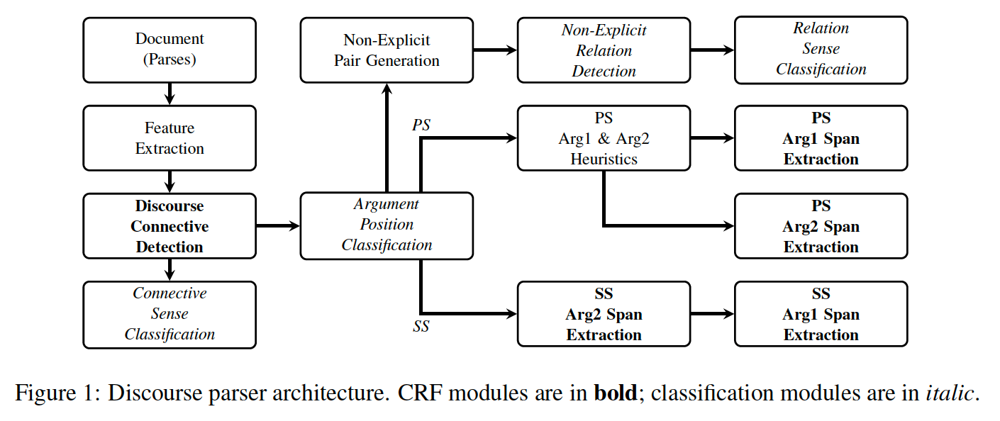
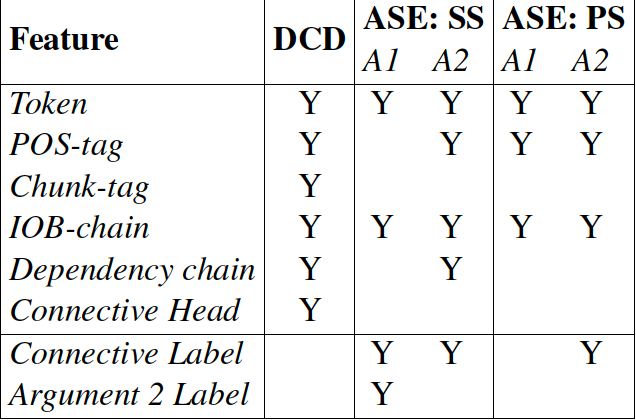
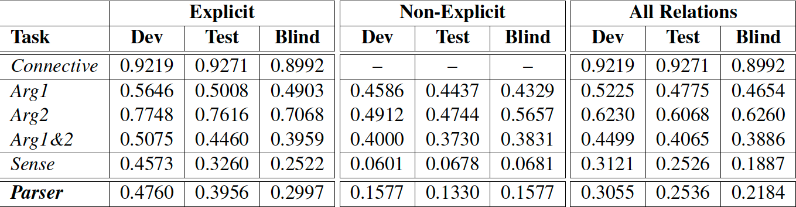

## Reference
[The UniTN Discourse Parser in CoNLL 2015 Shared Task:
Token-level Sequence Labeling with Argument-specific Models](https://www.aclweb.org/anthology/K15-2003)

## System architecture

## machine learning tools
CRF: sequence tagging(word level), CRF++
Classification: AdaBoost Algorithm, icsiboost

## processing assumptions

Non-Explicit Pair Generation (NPG) step a list of adjacent
sentence pairs is generated omitting the
inter-sentential explicit relations identified in the
APC step.

## Features

### General Features types
Part-of-Speech tags\
constituency parses\
dependency parses. \

### Features.
3.1 Token-level Features\

Figure1 \

Chunk tag is location, 'B-NP' stands for beginning of the chunk tag\

IOB-chain syntactic tree node from root to the token. ‘I-S/B-VP’ indicates
that a token is the first word of the verb
phrase (B-VP) of the main clause (I-S).

Dependency chain is root to the word e.g. root/nsubj/det\

Connective label and arg2 label is avoid overlapping.

Other features explored:
(1) morphological: lemma and inflection; \
(2) dependency:
main verb of a sentence (i.e. root of the
dependency parse) as a string and binary feature;\
(3) Connective Head as string\
`Note: They are excluded because greedy hill climbing their contribution were negative)`

CRF token level feat enriched with n grams:
1,2,3 grams, with window of +- 2 tokens. so there are 5 unigrams, 4 bigrams, 3 trigrams for each token per feature type.

3.2 Argument-relation level features\

For Non-Explicit Discourse
Relation Detection and Sense Classification task
1. Bag-of-Words;
2. Bag-of-Words prefixed with the argument ID
(Arg1 or Arg2);
3. Cartesian product of all the tokens from both
arguments;
4. Set of unique pairs from Cartesian product of
Brown Clusters of all the tokens from both
arguments (inspired by (Rutherford and Xue,
2014));
5. First, last, and first 3 words of each argument
(from (Pitler et al., 2009; Rutherford
and Xue, 2014));
6. Predicate, subject (both passive and active),
direct and indirect objects, extracted from dependency
parses (8 features);
7. Ternary features for pairs from 6 to indicate
matches (1, 0) or NULL, if one of the arguments
misses the feature (extension of ‘similar
subjects or main predicates’ feature of
(Rutherford and Xue, 2014)) (16 features);
8. Cartesian product of Brown Clusters of 6 (16
features);

## Features analysis

Note: add the evaluations are done on the dev set.

4.1 Discourse Connective Detection\
Token level feature with 12 feature from (1,2,3) gram get F1 0.85 \
adding other features gradually make it to 0.938\
feature boost most performance: IOB-chain. \
`emrys: this may because position in the sentence distinguish what is its relation with arg1 and arg2.`

4.2 Connective Sense Classification\
flat classification is better than hierarchary classification \
emrys: this may due to error cascading \
ngrams only gives an accuracy of 0.8968. 

just using connective, into 4 classes accuracy 0.9426, adding POS does not help much.

4.3 Argument Position Classifier\
accuracy 0.9868

4.4 argument span detection

multi-sentence classification is missed. \
arg1 detection of sentential relations is a hard task, since there are no arg2 to delimit it. emrys: is the percentage not very large? \
Therefore, for intersentential arg1 position they are using heuristic. \
for intersentential arg2 gives 80% by using CRF++.

for intrasentential performance is high for arg2 since it is syntactically attached to arg1. \
`their experiment show that pos tag have a negative effect on arg1 span extraction`

4.5 Non-Explicit Relation Detection

Experiment tried:
1. Flat classification into DPTB senses + no-relation
2. Relation vs No-relation classification -> relation classification: better accuracy of 0.6988 (test development set with gold standard span, if we without the argument span the performance will drop significantly).

`Most powerful feature is 
1. Cartesian product of Brown Cluster of all the tokens from both args.
2. Cartesian product of Brown Clusters of predicate, subj and deobj and indirect obj.

4.6 Relations sense extraction:\
The Features used are from 3.2, without bag of words and cartesian product of each feature.

`The model misses infrequent senses. and the distribution of senses has a direct effect on its F-measure`\
`emrys: precision is normally higher than recall, which means once they are able to identify the args, it is ok for them to identify the task`

## Evaluation

metric
the same evaluation metric as workshop evaluation part.

future Improvements:
1. The hardest task is the non-explict relation extraction
2. the next hardest task is intersentential arg1 extraction, as they dont know whether can take the whole of previous sentence or some part of the previous sentence.

