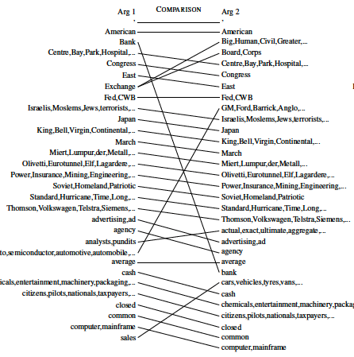
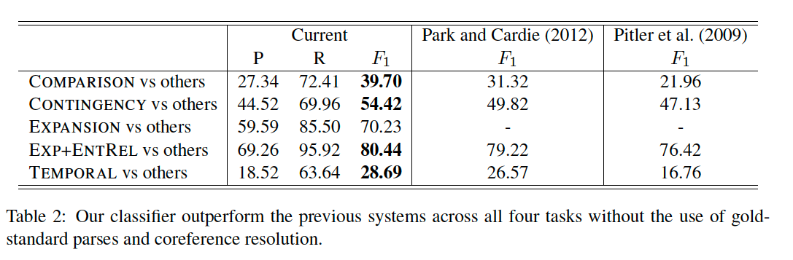
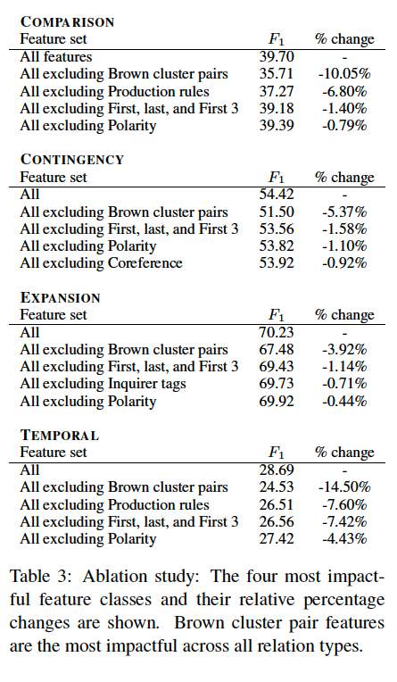
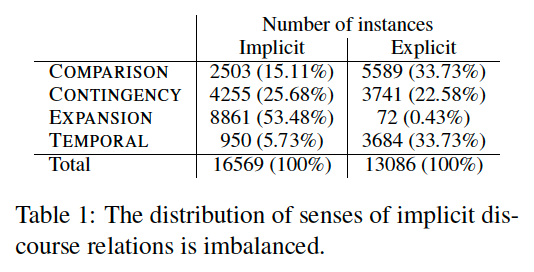

# Paper:
Discovering Implicit Discourse Relations Through Brown Cluster Pair
Representation and Coreference Patterns

## overall contribution
Brown clusters => word-level semantic commonalities revealed \
coreference resolution => entity-level relations revealed 
=> a more complete picture of the
discourse relation in question.

Coference resolution => patterns of entity occurences => clues for types.\
because The information
about certain entities or mentions in one sentence
should be carried over to the next sentence to form
a coherent relation.

## Features 
all the features are from NLP tools\
1. lemmatizing and POS by stanford CoreNLP\
2. phrase structure and depedency parses for each sentence\
3. identify all named entities\
4. resolve conference\
5. Brown cluster pair features
6. Coreference based features

Features used by previous work: (pitler 2009)
1. First, last, and first 3 words, 
2. numerical expressions,
3. time expressions, 
4. average verb phrase
5. length, 
6. modality, 
7. General Inquirer tags, 
8. polarity,
9. Levin verb classes, and 
10. production rules.

## Brown cluster pair

Brown cluster:\
Brown clustering algorithm
induces a hierarchy of words in a large unannotated
corpus based on word co-occurrences within
the window. The induced hierarchy might give
rise to features that we would otherwise miss.

Brown cluster algorithm: \
TODO: search for it!

Motivation:\
word pair features are known for its effectiveness in predicting senses of discourse relations between the two arguments. \
emrys: this serves as an effect as attention.

Works well only if large dataset to fit the parameters.\
If dataset not large enough, would cause large sparse vectors.\
other less sparse handcrafted features(pitler et al 2009) are also used to remedy this problem. \
Here used clustering the words that are distributionally simialr together to reduce the sparsity problem.

Reduced the feature size: from O(V^2) to O(3200^2).

Reference:\
Used Brown clusters provided by MetaOptimize (Turian et al., 2010). \
3,200 clusters were induced from
RCV1 corpus, which contains about 63 million tokens
from Reuters English newswire. 

Implementation: \
cartesian product of the brown cluster assignment of the words in arg1 and the ones of the words in arg2.

FINDINGS: \
by using I(X,Y) to find each feature in brown_cluster relation with each relation type:\

### COMPARISON, 
it might be juxtaposing and explictly contrasting two different entities, in two adjecent sentences.\

### CONTIGENCY: 
the sentence structure will likely be entity in one cluster systematically matches the entity in the other cluster. e.g. stock and trading may pair up with economic terms. Or they from the semantically related words.

### Expansion 
relations captures one cluster is the specification of the other. e.g. industrial categories with a specific brand or category.\
person enter the room first addressed by first name and then addressed by surname.

### TEMPORARY 
relation often exist in arg2 have time cluster. it is possible that if arg2 have the time indication, the connective is usually losted.\
It is also exist in when there is a change in number. e.g. `increase, decrease` over time.

## Coreference based features
We consider various inter-sentential coreference
patterns to include as features and also to better
describe each type of discourse relation with respect
to its place in the coreference chain.

1. Number of coreferential pairs: \
`EXPANSION relations should be more likely to have coreferential pairs because the detail or information about an entity mentioned in Arg1 should be expanded in Arg2.`

2. Similar nouns or verbs: \
a binary feature if `similar or coreferential` nouns are the arguments of the similar predicates. (predicates and arguments are identified by dependency parses.)

`this would work for identifying "contingency" as they usually discuss two casually related events that seemingly unrelated agents`

3. similar subject or main predicates: \
1) binary feature for main verbs indicating the main subject or not 
2) binary feature for main verbs are similar or not \
"comparison" relations usually have different subjects for main verbs and "temporary" relations have same subjects but different main verbs.

FINDINGS:
### TEMPORAL
relations have a significantly higher coreferential
rate than the other three relations.

If sentences
are coreferentially linked, then it might be
more natural to drop a discourse connective because
the temporal ordering can be easily inferred
without it. \
 For example,
(1) Her story is partly one of personal downfall. [previously] She was an unstinting
teacher who won laurels and inspired students...

CONTINGENCY and TEMPORAL can be highly confusable. Since chaning a pronoun can be classified as TEMPORARY instead of CONTIGENCY. \
Therefore, in the example below. This feature can be used to help distinguish the two\
example: \
He also asserted that exact questions weren’t
replicated. [Then] When referred to the questions
that match, he said it was coincidental.
(WSJ0045)\
He also asserted that exact questions weren’t
replicated. When referred to the questions
that match, she said it was coincidental.

## Experiment
one-against binary classification x 4.\
merge ENTREL with Exapansion relations to follow two baseline system. \
assume gold standard pair is given.

Statistical model using mallet and libsvm.

### class imbalance addressing
Park and Cardie
(2012) and Wang et al. (2012) addressed these
problems directly by optimally select a subset of
features and training samples.

do not discard each task but reweight the training samples in each class during
parameter estimation.
### 
code available at: github.com/attapol/brown_coref_implicit

## Results
Navie Bayes classifier outperforms MaxEnt, BalancedWinnow,
and Support Vector Machine across all tasks regardless
of feature pruning criteria and training
sample reweighting. 

`note: A possible explanation is that the small dataset size in comparison with the large number of features might favor a generative model like Naive Bayes`

Ablation study:

Ablation study show that :
1. Brown cluster features is the most important regardless of relation types.
2. Temporary benefit most from Brown cluster, F1 drops 14.5% relative to the system that uses all the feature.

### Dataset features

implications of implict discourse relations: (Patterson and
Kehler, 2013)\
`Temporary` relations constitue 5% of implicit relations, as they are hard to create witout discourse connectives.\
`Expansion` are mostly implicit.\
This imbalance needs greater care in builing statistical classifiers(Wang et al., 2012).

Names patterns:
