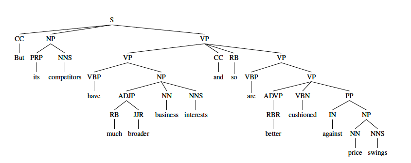
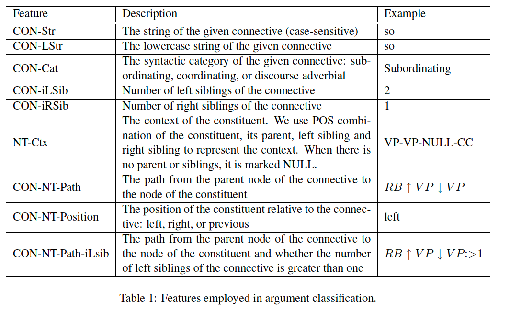

## Paper
A Constituent-Based Approach to Argument Labeling
with Joint Inference in Discourse Parsing

## Main idea
1. views constituents as candidate arguments.
2. our approach unifies intra- and
inter-sentence cases by treating the immediately
preceding sentence as a special constituent. 
3.  a joint inference mechanism is introduced to
incorporate global information across arguments
via integer linear programming.

## Previous approaches
subtree extraction used by lin zi heng 2014:\
node level subtraction, find the arg1 and arg2, if it is contained, use tree substraction.\
Pros:\
    using rich syntactic information
cons: \
    1 argument may contain several node. 2 upstream task of identify the previous task -- argument position classification may affect this one.\
for example:
arg1 contains CC NP VP-VP arg2 contains VP-CC VP-VP.

Linear tagging approach:\
uses CRF and model as sequence tagging task.\
works on the tokens of the sentence\
pros: capable of capturing local sequential dependency between tokens.

## Constituent approach
1. pruning\
obtain its siblings and the siblings as going from the connective to the root.\
different lin et al, where they obtain all the node. \
works apparently better in gold standard, value see the paper.
2. argument classification

## Joint inference via integer programming
motivations:\
ensure global consistencies in classification.\
e.g. number of discontinuous section for pdtb is at most 2.\
framed as integer linear programming question.

Objective function: maximize the total confidence score. see paper.

Constraints: see paper.

