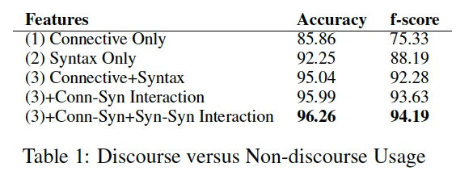
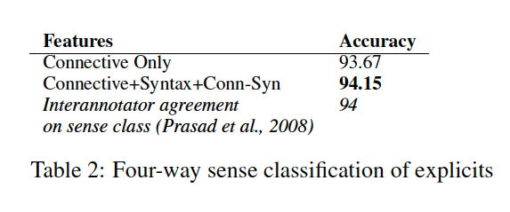

## Paper
Using Syntax to Disambiguate Explicit Discourse Connectives in Text\
Emily Pitler and Ani Nenkova\
https://www.aclweb.org/anthology/P09-2004 

## objective
predict top level categories.

## features
Self Category:\
The highest node in the tree which dominates the words in the connective but nothing else.\
For single word connectives, this
might correspond to the POS tag of the word, however
for multi-word connectives it will not\

e.g. if the self category is Noun phrase: "blue `and ` green", it will be hard to be a connective

left sibling category:\
The syntactic category
of the sibling immediately to the left of the Self
Category. If the left sibling does not exist, this features
takes the value “NONE”.

right sibling category:\
this one determines which one is able to 
English is a right-branching language,
and so dependents tend to occur after their heads.
Thus, the right sibling is particularly important as
it is often the dependent of the potential discourse
connective under investigation.\
For example,
the discourse usage in “After I went to the store,
I went home” can be distinguished from the nondiscourse
usage in “After May, I will go on vacation”
based on the categories of their right siblings.

`emrys: this right sibling category and right sibling category tells us about two information: 1. the position of conn in the sentence, which potential role it can play. 2. what type of argument it is connecting.`

Right Sibling
Contains a VP and Right Sibling Contains
a Trace. \
`this give more detailed information about the argument it is connecting`

## results
Discourse vs non-discourse classification

Discourse sense classification
