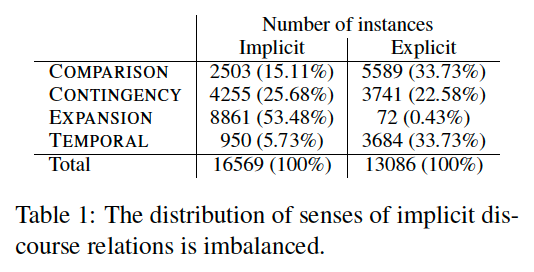

9% of all inter-sentential relations Argument 1 is located in non-adjacent previous sentence (Prasad et al., 2008)

See examples for each class at: 
[Data Annotation guide lines](https://www.seas.upenn.edu/~pdtb/PDTBAPI/pdtb-annotation-manual.pdf)

### explicit classification
from [Using Syntax to Disambiguate Explicit Discourse Connectives in Text]
1. Of the 100 connectives annotated in the PDTB,
only 11 appear as a discourse connective more
than 90% of the time: although, in turn, afterward,
consequently, additionally, alternatively,
whereas, on the contrary, if and when, lest, and on
the one hand...on the other hand.\
while or only serves a discourse function
2.8% of the times it appears
2. 
### Implict classification

implications of implict discourse relations: (Patterson and
Kehler, 2013)\
`Temporary` relations constitue 5% of implicit relations, as they are hard to create witout discourse connectives.\
`Expansion` are mostly implicit.\
This imbalance needs greater care in builing statistical classifiers(Wang et al., 2012).

Coreference patterns